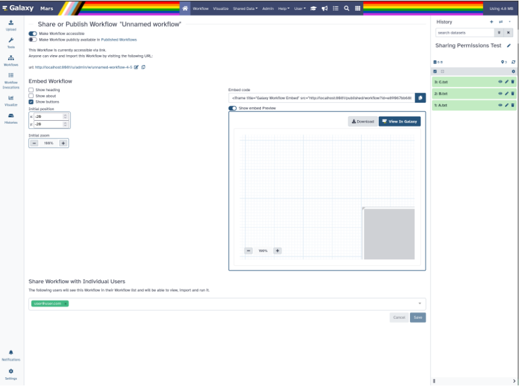

# 2023 Galaxy Release (v 23.2)

The Galaxy Committers team is pleased to announce the Galaxy 23.2 release!

- **[Developer and admin release announcement](https://docs.galaxyproject.org/en/master/releases/23.2_announce.html)**.
- **[User release announcement](https://docs.galaxyproject.org/en/master/releases/23.2_announce_user.html)**.

A few release highlights are:

## Workflow Updates

### Workflow comments

Workflow comments are a brand new feature of the Galaxy Workflow Editor. They add a suite of tools to help you visually explain and structure your Workflows. Comments are saved on your workflow, so they can be shared with other workflow contributors, help guide workflow users, or just help you keep track of your work and sort your thoughts, while developing a workflow. They can also help you with teaching, live demos, and providing feedback on a workflow, all directly inside the workflow editor!

Workflow comments tools are made available as part of the Editor Toolbar - a new UI element in the workflow editor. They include:

* a snapping tool that makes it very easy to align your steps and comments to the workflow grid;
* a text comment tool that comes with  rich styling options;
* a markdown comment tool for longer, rich-text, explanations or notes;
* a frame comments tool that allows you to visually group parts of your workflow together, steps and comments alike;
* freehand comments tools - a pen and an eraser that enable drawing directly on your Workflow, making them perfect for showing what you are referring to in live demos, leaving quick marks when reviewing or debugging a Workflow, drawing arrows to show what your markdown comment is referring to, etc.

<iframe width="560" height="315" src="https://www.youtube.com/embed/ndPeBov5O0s" title="Galaxy 23.2 - Workflow Comments - Placing Text Comments" frameborder="0" allow="accelerometer; autoplay; clipboard-write; encrypted-media; gyroscope; picture-in-picture; web-share" allowfullscreen></iframe>

<iframe width="560" height="315" src="https://www.youtube.com/embed/lAOvpGRxTk4" title="Galaxy 23.2 - Workflow Comments -  Placing Frame Comments" frameborder="0" allow="accelerometer; autoplay; clipboard-write; encrypted-media; gyroscope; picture-in-picture; web-share" allowfullscreen></iframe>

### Workflow sharing

The Published Workflow Sharing page UI has been overhauled to make the page more informative, visually appealing, and easier to navigate. Some of the key improvements include adding a new read-only mode to the workflow editor, embedding an interactive view of the workflow editor, adding more information about the workflow, adding a run button, etc. The page is now responsive, which makes it usable on smaller screens.

### Workflow publishing

Workflow Publishing now has a configurable iframe embed:

### Workflow reports

In response to user feedback and suggestions, a lot of work went into improving the page and workflow report editor options. Workflow image and license information have been added to Galaxy markdown capabilities. Workflow version is now included in the report; time is displayed in UTC time format. A variety of minor issues including invocation report and the job metrics markdown component have been fixed. To address requests to add citation information for the Galaxy instance on which the workflow has been executed, several new directives have been added to Galaxy Markdown: Galaxy URL, organization URL, citation URL, support URL, help URL, terms URL, and resources URL - alongside new configuration options to support them.

## InvenioRDM Integrated into Galaxy

InvenioRDM has been integrated into Galaxy. Users can now import files directly from InvenioRDM repositories into Galaxy, and publish records containing artifacts (Histories, datasets, etc.) from Galaxy to InvenioRDM.

### Importing data

To import from InvenioRDM, you simply select the InvenioRDM repository as a remote file source in the *Upload* tool and then select the records or individual files you want to import into your history, just like you would do with any other remote file source in Galaxy:

<iframe width="560" height="315" src="https://www.youtube.com/embed/GzN6heU70j4" title="Galaxy 23.2 - Invenio - Importing Datasets" frameborder="0" allow="accelerometer; autoplay; clipboard-write; encrypted-media; gyroscope; picture-in-picture; web-share" allowfullscreen></iframe>

### Exporting data

To export your data to InvenioRDM, you need to set up your InvenioRDM API personal token. You can create a new personal token in your InvenioRDM account settings if you don't have one. In Galaxy, you need to add that personal token to your account (go to *User > Preferences > Manage Information*).

### Exporting your Histories

Once you have set your personal token, you can publish your histories by selecting the InvenioRDM repository as a remote file source in the *Export History to File* menu option. You will be able to select an existing draft record or create a new one, and the files will be uploaded to it. Once exported, you will be able to import the history snapshot from the published record at any time.

<iframe width="560" height="315" src="https://www.youtube.com/embed/Qoy-buGb26Y" title="Galaxy 23.2 - Invenio - Exporting Histories" frameborder="0" allow="accelerometer; autoplay; clipboard-write; encrypted-media; gyroscope; picture-in-picture; web-share" allowfullscreen></iframe>

### Archiving your Histories

When you are completely happy with your history, you can archive it, taking it out of your active histories and freeing up some disk quota. You can do so by selecting the *Archive History* menu option. The process will be similar to exporting a history; however, your history will be purged from Galaxy once the process is completed. You will be able to import the history as a copy from the published record at any time.

<iframe width="560" height="315" src="https://www.youtube.com/embed/CNXQphjW6LE" title="Galaxy 23.2 - Invenio - Archiving Histories" frameborder="0" allow="accelerometer; autoplay; clipboard-write; encrypted-media; gyroscope; picture-in-picture; web-share" allowfullscreen></iframe>

### Exporting your Datasets

You can also publish individual datasets to InvenioRDM by selecting the InvenioRDM repository as a remote file source using the *Export Datasets* tool. Since the tool interface is a bit limited, you will need to create your draft record manually in advance, and then you can select it when exporting the datasets.

<iframe width="560" height="315" src="https://www.youtube.com/embed/t3baif6JFfA" title="Galaxy 23.2 - Invenio - Exporting Datasets" frameborder="0" allow="accelerometer; autoplay; clipboard-write; encrypted-media; gyroscope; picture-in-picture; web-share" allowfullscreen></iframe>

## Miscellaneous Improvements

The 23.2 release includes many other improvements to user experience. Following are a few examples:

* Galaxy Help forum has been integrated into the tool form: relevant posts are now part of the form; pressing the *Ask a New Question* button pre-fills the title and tags with the tools name and id respectively.
* To encourage best practices and steer users away from problematic datatypes, datatype upload warnings have been added to the Upload tool.
* Form repeat blocks are now reorderable: new UI additions include *Move Up/Move Down* buttons, as well as focus highlighting, so the active repeat block can be followed visually when moved.
* Scroll pagination and username filter have been added to the list of published histories.
* Currently viewed/edited datasets are now visually indicated in the list of datasets on the right sidebar.
* A new button allows easy switching to a history from the Histories Storage Overview in Storage Dashboard Visualizations.
* Broadcast Notifications have received a facelift, making them more readable and less intrusive.
* Tool IDs are now searchable in the side panel search box with queries "id:sample_id" or "tool_id:sample_id".
* You can now search for partial matches in workflow #name tags; all tags will be search in unquoted queries.
* When a user clicks on the "eye" button for a binary dataset or a dataset with an unknown type, Galaxy will no longer attempt to download the entire file, which is not what the user wants for large files. Instead, Galaxy displays a descriptive warning message, as well as first 100K of the data as ASCII text.
* Galaxy caching policies have been tightened: displaying a datasets's filename no longer pulls the entire file into cache; pulling the data is now postponed until that data is really needed.
* Canceling an active workflow run will now cancel all of the running jobs of that workflow run.
* Work is underway on an all new Tool Shed 2.0 - a major upgrade that cuts ties to old technologies and old concepts. The new tool shed is built on FastAPI, Typescript, Vue 3.2, Vite, Pinia, Quasar, and GraphQL, with Planemo and Ephemeris integrated into the UX.

## Release notes

Please see the [full release notes](https://docs.galaxyproject.org/en/master/releases/23.2_announce.html) for all the details!

*Thanks for using Galaxy!*

[The Galaxy Team](https://galaxyproject.org/galaxy-team/)
