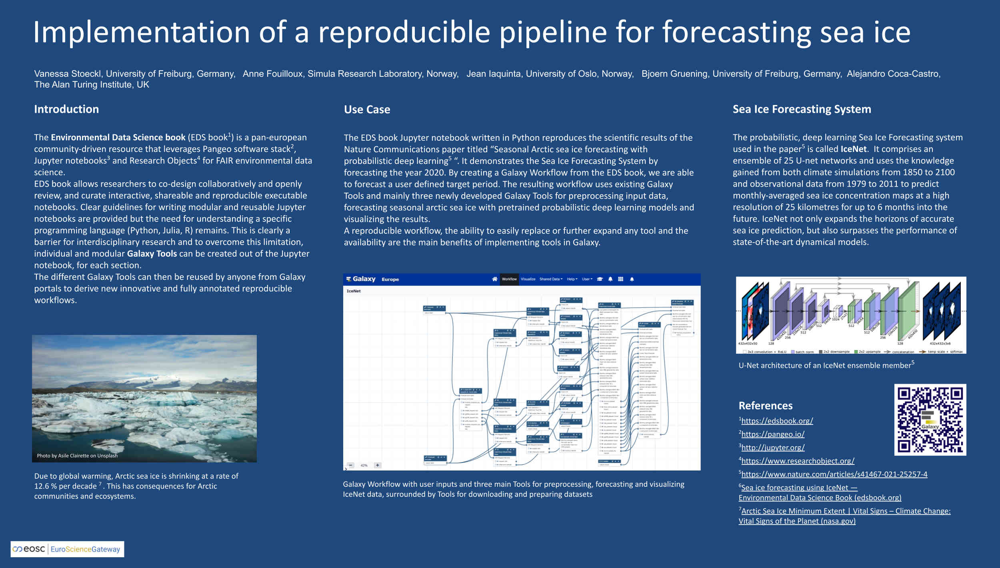

Hello, Galaxy Community!

The Galaxy Project is excited to highlight the poster presentation by Vanessa Stoeckl at the European Geoscience Union (EGU) Conference 2024! 

“Implementation of a reproducible pipeline for producing seasonal Arctic sea ice forecasts”, authored by Stoeckl et al. (2024), highlights the integration of [IceNet](https://icenet.ai) ([DOI: 10.1038/s41467-021-25257-4](https://doi.org/10.1038/s41467-021-25257-4)), a cutting-edge sea ice forecasting system leveraging numerous Python packages from the [Pangeo](https://pangeo.io) ecosystem, into the Galaxy platform. Aligned with the Pangeo ecosystem's broader objectives, and carried out in the frame of the [EuroScienceGateway project](https://eurosciencegateway.eu), this initiative embraces a collaborative approach to tackle significant geoscience data challenges. 

The aim is to democratize IceNet's capabilities by converting a Jupyter Notebook into Galaxy Tools for predicting Arctic sea ice concentration. This integration enables reproducible workflows and accessibility for scientists of all computational levels. Hosted on the European Galaxy Server, this initiative addresses the urgency of accurate predictions amid global warming. It aligns with Open Science principles and promotes collaborative efforts within the Pangeo community, facilitating interdisciplinary climate science research.

Listen to Vanessa in the following video to understand how the Galaxy workflow was created from the original Jupyter Notebook.

<!-- this is the embed code provided by Google -->
    <iframe width="560" height="569" src="https://w3id.org/ro-id/aab53e25-a351-46b0-bcfe-a0e0bf02f881/resources/008ec622-14d5-4327-889a-8dbb4d936fcd" frameborder="0" allowfullscreen></iframe>
      </iframe>
<!-- Google embed ends -->

*Check the corresponding Research Object [here](https://w3id.org/ro-id/aab53e25-a351-46b0-bcfe-a0e0bf02f881) and learn more about the IceNet project by visiting the [IceNet project website](https://icenet.ai)!*

Sincerely,
The Galaxy Project
